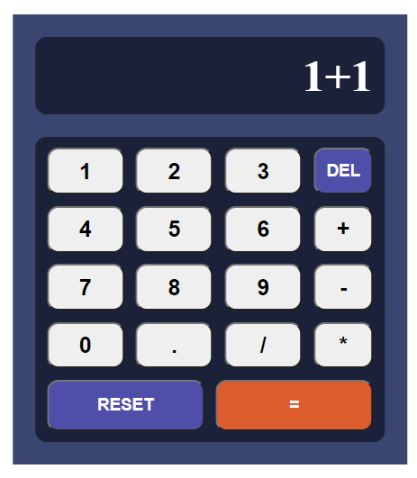
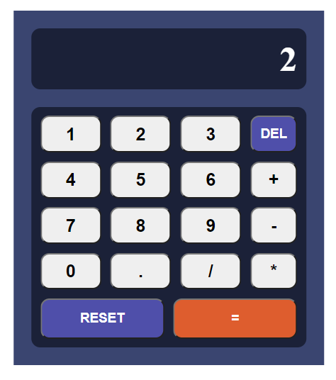

# Basic Calculator in React with TypeScript (Class Components)

This is a simple calculator application built with React, TypeScript, and class components. It allows you to perform basic arithmetic operations such as addition, subtraction, multiplication, and division. You can also clear the screen and delete characters one by one.

## Technologies Used

- React
- TypeScript
- Sass

## Installation

To run this calculator locally on your machine, follow these steps:

1. Clone this repository to your local machine:

   ```bash
   git clone https://github.com/your-username/calculator-app.git
   ```

2. Navigate to the project directory:

   ```bash
   cd calculator-app
   ```

3. Install the dependencies:

   ```bash
   npm install
   ```

4. Start the development server:

   ```bash
   npm run dev
   ```

5. Open your web browser and visit [http://localhost:5173](http://localhost:5173) to use the calculator.

## Usage

- Enter numbers and operators by clicking the buttons on the calculator's interface.
- Click the "Equal" button (`=`) to see the result of the calculation.
- Click the "Clear" button (`RESET`) to clear the screen.
- Click the "Delete" button (`DEL`) to remove the last character from the input.
- Perform basic arithmetic operations using the buttons (`+`, `-`, `*`, `/`).

## Screenshots

<div align="center">



<br/>



</div>

## Contributing

Contributions are welcome! If you'd like to contribute to this project, please follow these steps:

1. Fork the project.
2. Create your feature branch (`git checkout -b feature/your-feature-name`).
3. Commit your changes (`git commit -m 'Add some feature'`).
4. Push to the branch (`git push origin feature/your-feature-name`).
5. Open a pull request.

## Acknowledgments

- This calculator app was created as a simple example of React and TypeScript usage.
- Feel free to customize and expand upon it as needed for your own projects.

**¡Reach Further!** 🚀
